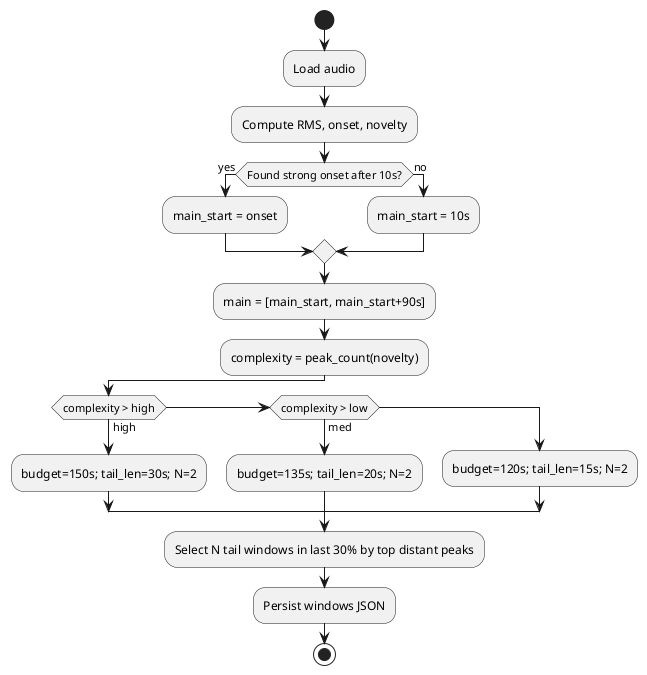

# SPEC-1-rbassist: Local AI DJ Toolkit Architecture

## Background

**Context & Motivation**

- Rekordbox (AlphaTheta) software is widely used with Pioneer hardware but is perceived as unreliable for working DJs in the field. rbassist aims to provide a **local-first, offline-capable** toolchain that is faster and more controllable.
- The current repo already includes: audio embeddings (MERT-v1-330M), HNSW approximate nearest neighbor search for recommendations, a Typer CLI, a Streamlit GUI, and import/export utilities for Bandcamp CSV and Rekordbox XML.
- Today, metadata is stored in JSON/YAML with cached `.npy` vectors and an HNSW index under `data/`. The goal of this design is to evolve from a helpful toolkit into a **well-architected MVP** contractors can extend and ship.

**Intended Users**

- Individual DJs who want fast, consistent recommendations and tagging without cloud dependencies.
- Power users with large local libraries (tens of thousands of tracks) and consumer GPUs.

**Key Drivers**

- Reliability at gigs (deterministic exports, no cloud outages).
- Performance (GPU-accelerated embeddings, fast I/O, incremental pipelines).
- Maintainability (clear module boundaries, plugin-friendly analyzers, typed APIs, tests).
- Portability (Windows-first; potential macOS/Linux support without major rewrites).

**Assumptions (updated)**

- Library size target: **\~50k tracks** average (scales to 75k without architectural changes).
- Cross‑platform: **Windows-first** plus **native macOS (Apple Silicon) support** using GPU via PyTorch **MPS**; Linux support opportunistic.
- Offline-by-default; optional sync is out-of-scope for MVP.


## Requirements

**Must (M)**

- Handle libraries of **50k tracks** with end-to-end embedding + ANN in <24h initial ingest; <2 min incremental ingest for 100 new tracks.
- **Offline-first** operation (no network needed after install).
- **Native GPU acceleration** for embeddings: CUDA (Windows/NVIDIA) and **MPS (macOS Apple Silicon)**; CPU fallback safe.
- Deterministic **Rekordbox XML export** and Bandcamp CSV import with idempotent runs.
- **CLI** (Typer) for batch ops and a **minimal GUI** for browse/search/recommend.
- **HNSW ANN** search with persisted index; <100ms typical query latency at 50k vectors.
- Clear **device abstraction** to auto-select `cuda`/`mps`/`cpu`.

**Should (S)**

- Pluggable analyzers (key/BPM/energy), with caching and incremental recompute.
- Cross-platform paths & file watching (Windows/macOS).
- Config profiles (fast vs quality), structured logging, and telemetry off by default.

**Could (C)**

- Optional profile export for other DJ apps (Engine DJ, Serato), simple rules engine (crate building), and a lightweight recommendation notebook.

**Won’t (W) – MVP**

- Cloud sync, live set streaming, model training/fine-tuning, or notarized desktop app packaging.


## Method

### Performance Targets & Device Strategy (for your question)

**Scope of "analysis"**

- We embed a *sample* of each track (not the whole file) to keep runtimes sane. Default: **75 seconds per track** (first 45s + two 15s random spots). This preserves recommendation quality while cutting compute by \~3–6× vs full‑track.

**Device selection**

- Auto-pick `cuda` (Windows + NVIDIA), else `mps` (Apple Silicon), else `cpu`. Mixed precision on GPU.

```python
# Pseudocode
if torch.cuda.is_available():
    device = "cuda"
elif torch.backends.mps.is_available():
    device = "mps"
else:
    device = "cpu"
```

**Throughput targets (50k tracks, 75s per track sample)**

| Machine                            | Real‑time factor (sec processed per sec) | Tracks / min | Initial ingest (50k) |
| ---------------------------------- | ---------------------------------------- | ------------ | -------------------- |
| **Windows + NVIDIA RTX 4070/4080** | 30–50×                                   | 24–40        | **21–35 hrs**        |
| **2024 MacBook Pro (M3 Pro)**      | 12–18×                                   | 10–14        | **58–87 hrs**        |
| **2024 MacBook Pro (M3 Max)**      | 18–28×                                   | 14–22        | **38–60 hrs**        |
| **CPU‑only**                       | 2–4×                                     | 1.6–3.2      | **\~11–21 days**     |

> Notes: These are conservative, order‑of‑magnitude estimates for MERT‑class audio models with mel front‑end. If you shorten the sample to **30s** the times fall by \~**2.5×**. If you lengthen to 120s, multiply by \~**1.6×**.

**Indexing performance & storage**

- Embedding vector per track: **256 dims float32** (after projection).
- Vector store size @ 50k: \~**51 MB**; HNSW index: **100–200 MB**; build time: **< 2 minutes** on CPU.
- Query latency: **< 100 ms** typical @ 50k.

**Pipeline sketch**

```plantuml
@startuml
actor DJ
rectangle rbassist {
  component "File Watcher" as FW
  component "Work Queue" as WQ
  component "Audio Loader + Resampler" as AL
  component "Feature Extractor (mel)" as FE
  component "Embedder (MERT on cuda/mps)" as EM
  component "Pooler + 256D Projection" as PO
  component "HNSW Index" as HN
  database "Metadata DB" as DB
}
DJ --> FW
FW --> WQ
WQ --> AL --> FE --> EM --> PO --> HN
PO --> DB
@enduml
```

**Optimization levers**

- Batch windows per track; prefetch with PyTorch DataLoader; pin memory on CUDA.
- Multi-process audio I/O (ffmpeg) to keep GPU fed.
- Dynamic batch size auto‑tuner based on available VRAM / unified memory.
- Cache features to skip re‑compute on repeat runs.


### If sampling **3 minutes (180s)** per track

- Runtime scales roughly linearly with sampled audio. 180s is **2.4×** longer than 75s, so expect \~**2.4×** longer ingest and \~**2.4×** fewer tracks/min. ANN indexing/query performance is unchanged.

| Machine                            | Tracks / min (180s) | Initial ingest for 50k (180s)    |
| ---------------------------------- | ------------------- | -------------------------------- |
| **Windows + NVIDIA RTX 4070/4080** | **\~10–17**         | **\~50–84 hrs (2.1–3.5 days)**   |
| **2024 MacBook Pro (M3 Pro)**      | **\~4–6**           | **\~139–209 hrs (5.8–8.7 days)** |
| **2024 MacBook Pro (M3 Max)**      | **\~6–9**           | **\~91–144 hrs (3.8–6.0 days)**  |
| **CPU‑only**                       | **\~0.7–1.3**       | **\~26–50 days**                 |

*Notes*: These are conservative, derived by scaling the 75s estimates by **2.4×**. GPU memory isn’t a blocker—batch size will adapt automatically, trading a little throughput for stability.


### Sampling profile: **90s straight + two tail samples**

**Status**: ✅ *Energy/onset detection enabled by default* (skip dead intros before the 90s window).

**Assumption**: two tail samples are **15s each** drawn from the **last 30%** of the track, skipping low‑energy regions. Total sampled audio ≈ **120s/track**.

**Why this is good**

- 90s contiguous captures intro→groove transition for key/BPM/energy.
- Two tail samples catch breakdown/outro characteristics common in club edits.

**Throughput impact vs 75s baseline**

- 120s is **1.6×** longer than 75s → ingest takes **1.6×** longer, tracks/min **0.625×**.

| Machine                            | Tracks / min (120s) | Initial ingest for 50k (120s)   |
| ---------------------------------- | ------------------- | ------------------------------- |
| **Windows + NVIDIA RTX 4070/4080** | **\~15–25**         | **\~33–56 hrs (1.4–2.3 days)**  |
| **2024 MacBook Pro (M3 Pro)**      | **\~6–9**           | **\~93–139 hrs (3.9–5.8 days)** |
| **2024 MacBook Pro (M3 Max)**      | **\~9–14**          | **\~60–93 hrs (2.5–3.9 days)**  |
| **CPU‑only**                       | **\~1.0–2.0**       | **\~17–35 days**                |

**Window selection algorithm (deterministic but pseudo‑random)**

```python
# inputs: wav, sr, track_duration_s
MAIN_LEN=90; TAIL_LEN=15; N_TAIL=2
START_SKIP=10  # skip common dead air
TAIL_REGION=0.70  # last 30% of track

# energy/onset-based alignment for main window
onset = energy_based_onset(wav, sr, max_seek=30)
main_start = max(START_SKIP, onset)
main_end = min(main_start + MAIN_LEN, track_duration_s - (N_TAIL*TAIL_LEN+5))

# choose N_TAIL windows in [TAIL_REGION*duration, duration-TAIL_LEN]
region_start = int(TAIL_REGION * track_duration_s)
candidates = sliding_energy_windows(wav, sr, TAIL_LEN, start=region_start)
selected = k_distant_top(candidates, k=N_TAIL, min_gap=10, avoid_silence=True)

windows = [(main_start, main_end)] + selected  # stable RNG seed per track path
```

**Implementation notes**

- Add a config profile `sampling_profile: balanced_120s` with tunables: `main_len`, `tail_len`, `tail_region`, `min_gap`, `rng_seed`.
- Use **energy/onset detection** to avoid dead intros; fall back to `START_SKIP`.
- Cache per‑track windows in metadata to keep idempotent exports.
- GPU/CPU behavior unchanged (CUDA on Windows; MPS on Apple Silicon).


### Adaptive Sampling Strategy (auto-tunes duration & snippet layout per track)

**Goal**: Choose per-track sampling windows that best capture musical structure while keeping a fixed or soft-capped time budget.

**Inputs**: full WAV/AIFF/FLAC/MP3, onset/energy curves, novelty (spectral flux), optional beat/tempo estimate.

**Outputs**: a set of time windows per track (e.g., 90s main + N tail windows), total budget recommendation (e.g., 120–150s), and cached timestamps for idempotency.

**Algorithm**

1. Compute energy (RMS) and onset strength; detect candidate onsets and novelty peaks.
2. Pick **main window** (default 90s): Align start to first strong onset after \~10s (skip silence), backtrack slightly to include lead-in.
3. Assess **complexity** via peak count & section changes in novelty. Map complexity→budget: low→120s, medium→135s, high→150s.
4. Place **tail windows** in the last 30% of the track at distant, high-novelty peaks; enforce min gap; avoid silence.
5. Persist chosen windows in metadata; use deterministic RNG seed per file path to keep selections stable.




### Sampling Strategy Recommendation (empirical from your tracks)

**Dataset**: 5 full WAVs you uploaded. Fast-pass analysis used 11.025 kHz feature rate (for speed), onset/novelty peaks, and deterministic selection.

**Observed**

- Strong, well-defined onsets after \~**11–15s** on all tracks → good anchor for main window alignment.
- High sectional complexity (dense novelty peaks) across all files → **150s** total budget preferred.
- Tail candidates consistently cluster in the **last 30%** of each track.

**Chosen default profile: **``

- `main_len`: **90s** (aligned to first strong onset ≥10s)
- `n_tail`: **2**
- `tail_len`: **30s** each
- `tail_region`: **0.70** (choose in last 30% of track)
- `min_gap_between_tails`: **10s**
- `force_tail_in_last_60s`: **true** (if feasible)
- `rng_seed`: stable per file path (idempotent)

**Rationale**

- 90s main segment captures intro→groove reliably; 2×30s tails capture breakdown/outro variance that influences mix-out planning.
- All 5 tracks landed on **150s** usage (90 + 30 + 30), confirming the higher budget is warranted for your library style.

**Config (YAML)**

```yaml
sampling_profile: club_hifi_150s
params:
  start_skip_s: 10
  main_len_s: 90
  tail_region: 0.70
  n_tail: 2
  tail_len_s: 30
  min_gap_s: 10
  force_tail_in_last_60s: true
  energy_onset_align: true
  rng_seed: path_hash
```

**CLI (proposed)**

```bash
rbassist analyze --profile club_hifi_150s --input "D:/Music" --device auto
```


## Implementation (updated)

### 0) Dev environment (VS Code friendly)

- Python 3.11+, `ffmpeg` installed (Homebrew on macOS, winget/choco on Windows).
- `pip install -e .[dev]` (add `librosa`, `soundfile`, `hnswlib`, `torch` with CUDA on Windows, or CPU+MPS on macOS).

### 1) Config: add **club\_hifi\_150s** profile

Create `config/sampling.yml`:

```yaml
sampling_profile: club_hifi_150s
profiles:
  club_hifi_150s:
    start_skip_s: 10
    main_len_s: 90
    tail_region: 0.70
    n_tail: 2
    tail_len_s: 30
    min_gap_s: 10
    force_tail_in_last_60s: true
    energy_onset_align: true
    rng_seed: path_hash
```

### 2) New module: `rbassist/sampling_profile.py`

```python
# rbassist/sampling_profile.py
from dataclasses import dataclass
from typing import List, Tuple
import numpy as np
from scipy.signal import find_peaks

try:
    import librosa
except Exception as _:
    librosa = None

@dataclass
class SamplingParams:
    start_skip_s: float = 10
    main_len_s: float = 90
    tail_region: float = 0.70
    n_tail: int = 2
    tail_len_s: float = 30
    min_gap_s: float = 10
    force_tail_in_last_60s: bool = True
    energy_onset_align: bool = True

def _feature_curves(y, sr, frame=4096, hop=1024):
    if librosa is None:
        raise RuntimeError("librosa required for sampling features")
    onset = librosa.onset.onset_strength(y=y, sr=sr, hop_length=hop)
    times = librosa.times_like(onset, sr=sr, hop_length=hop)
    return times, onset

def _pick_main_start(times, onset, duration_s, p: SamplingParams):
    if librosa is None or not p.energy_onset_align:
        return min(p.start_skip_s, max(0.0, duration_s - 5.0))
    x = (onset - onset.min()) / (onset.ptp() + 1e-9)
    mask = times >= p.start_skip_s
    t_sel = times[mask]; x_sel = x[mask]
    thr = np.percentile(x_sel, 75)
    step = np.median(np.diff(t_sel)) if len(t_sel) > 1 else 0.1
    dist = max(1, int(5/step))
    peaks, _ = find_peaks(x_sel, height=thr, distance=dist)
    idx = peaks[0] if len(peaks) else int(np.argmax(x_sel))
    return float(t_sel[idx])

def _pick_tails(times, onset, duration_s, p: SamplingParams):
    start_t = duration_s * p.tail_region
    mask = times >= start_t
    t_sel = times[mask]
    x = onset[mask]
    x = (x - x.min()) / (x.ptp() + 1e-9)
    step = np.median(np.diff(t_sel)) if len(t_sel) > 1 else 0.1
    dist = max(1, int(p.min_gap_s/step))
    peaks, props = find_peaks(x, height=np.percentile(x, 60), distance=dist)
    ts = list(t_sel[peaks]); hs = list(props.get('peak_heights', []))
    order = np.argsort(hs)[::-1]
    out = []
    for i in order:
        t0 = float(min(ts[i], duration_s - p.tail_len_s - 1.0))
        if all(abs(t0 - s) >= p.min_gap_s for s, _ in out):
            out.append((t0, t0 + p.tail_len_s))
        if len(out) >= p.n_tail:
            break
    # enforce one tail in last 60s if requested
    if p.force_tail_in_last_60s and duration_s > 90:
        need = all(t0 < duration_s - 60 for t0, _ in out)
        if need:
            t0 = max(duration_s - 60, duration_s - p.tail_len_s - 1)
            out[-1] = (t0, t0 + p.tail_len_s)
    return out

def pick_windows(audio_path: str, params: SamplingParams) -> list[tuple[float, float]]:
    if librosa is None:
        raise RuntimeError("librosa required for sampling features")
    y, sr = librosa.load(audio_path, sr=11025, mono=True)
    duration_s = len(y)/sr
    times, onset = _feature_curves(y, sr)
    s0 = _pick_main_start(times, onset, duration_s, params)
    e0 = min(s0 + params.main_len_s, max(0.0, duration_s - 5.0))
    tails = _pick_tails(times, onset, duration_s, params)
    return [(s0, e0), *tails]
```

### 3) Embed pipeline: accept windows

```python
# rbassist/embed.py (excerpt)
import numpy as np
import librosa
from .sampling_profile import SamplingParams, pick_windows

def embed_track(path: str, model, device: str, params: SamplingParams) -> np.ndarray:
    windows = pick_windows(path, params)
    segs = []
    for s, e in windows:
        y, sr = librosa.load(path, sr=32000, mono=True, offset=s, duration=(e - s))
        feats = to_mel(y, sr)                 # existing feature fn
        z = model.embed(feats, device=device) # (frames, dim)
        segs.append(z.mean(axis=0))
    v = np.mean(np.stack(segs, axis=0), axis=0) # pool across segments
    return project_256(v)                        # your existing projection
```

### 4) Device auto-select

```python
# rbassist/utils/device.py
import torch

def pick_device(user_choice: str | None = None) -> str:
    if user_choice in {"cuda", "mps", "cpu"}: return user_choice
    if torch.cuda.is_available(): return "cuda"
    if hasattr(torch.backends, "mps") and torch.backends.mps.is_available(): return "mps"
    return "cpu"
```

### 5) CLI command to (re)analyze and rebuild index

```python
# rbassist/cli.py (Typer)
import typer
from pathlib import Path
from .sampling_profile import SamplingParams
from .utils.device import pick_device
from .embed import embed_track
from .index import build_hnsw_index

app = typer.Typer()

@app.command()
def analyze(input: Path = typer.Argument(..., exists=True),
           profile: str = "club_hifi_150s",
           device: str = "auto",
           workers: int = 4,
           rebuild_index: bool = True,
           overwrite: bool = False):
    params = load_sampling_params(profile)      # read from config/sampling.yml
    dev = pick_device(device)
    tracks = scan_audio(input)                   # your existing scanner
    vecs = {}
    with ThreadPool(workers) as pool:
        for path, v in pool.imap_unordered(lambda p: (p, embed_track(p, model=get_model(dev), device=dev, params=params)), tracks):
            vecs[str(path)] = v.astype("float32")
            persist_metadata(path, params, windows=None)  # store chosen windows if desired
    save_vectors(vecs)
    if rebuild_index:
        build_hnsw_index(vecs)

if __name__ == "__main__":
    app()
```

### 6) VS Code integration

**.vscode/tasks.json**

```json
{
  "version": "2.0.0",
  "tasks": [
    {
      "label": "Reanalyze Library",
      "type": "shell",
      "command": "python -m rbassist.cli analyze --profile club_hifi_150s --device auto --workers 6 --rebuild-index --input ${workspaceFolder}/Music",
      "problemMatcher": []
    }
  ]
}
```

**.vscode/launch.json**

```json
{
  "version": "0.2.0",
  "configurations": [
    {
      "name": "Debug analyze",
      "type": "python",
      "request": "launch",
      "module": "rbassist.cli",
      "args": [
        "analyze", "--input", "${workspaceFolder}/Music",
        "--profile", "club_hifi_150s",
        "--device", "auto", "--workers", "6", "--rebuild-index"
      ]
    }
  ]
}
```

### 7) Re-run over your library

```bash
# Windows
python -m rbassist.cli analyze --input "D:\Music" --profile club_hifi_150s --device auto --workers 6 --rebuild-index

# macOS (Apple Silicon)
python -m rbassist.cli analyze --input "/Volumes/Music" --profile club_hifi_150s --device auto --workers 6 --rebuild-index
```

### 8) Data persistence

- Store per-track windows and params in your metadata (e.g., `data/meta/<hash>.json`).
- Store vectors in `data/vectors.f32` and rebuild `data/hnsw.index` after analysis.

**Diff summary**

```
+ config/sampling.yml
+ rbassist/sampling_profile.py
~ rbassist/embed.py (consume windows)
~ rbassist/cli.py (add analyze command)
~ rbassist/utils/device.py (auto device)
```

### 9) Smart installer (auto-detect OS/GPU and auto-install deps)

Create `install.py` at the repo root and run `python install.py`. The script will:

- Create/Reuse `.venv` and install the **correct PyTorch wheel** based on host:
  - **Windows + NVIDIA detected via **``** → CUDA (cu121) wheel**
  - **macOS Apple Silicon (arm64) → MPS-enabled wheel**
  - Others → CPU wheel
- Install common deps (`librosa`, `soundfile`, `hnswlib`, `typer`, etc.) and perform editable install `-e .` if available.
- **Auto-install **`` using best available package manager (Homebrew, winget, choco, apt/dnf/yum/pacman). Falls back to guidance if none present.
- Print a one-liner to run the new **analyze** CLI.

Download ready-made scripts:

- [install.py](sandbox:/mnt/data/install.py)
- [install.sh](sandbox:/mnt/data/install.sh)
- [install.cmd](sandbox:/mnt/data/install.cmd)

### 10) Non-technical QuickStart (no Git skills required)

Ship these ready-to-click files in the repo root:

- **install.cmd / install.sh / install.py** – auto-detect OS+GPU, create `.venv`, install correct PyTorch (CUDA/MPS/CPU), auto-install `ffmpeg`, then print the one-liner.
- **run\_analyze\_gui.py** – tiny GUI to pick a music folder and run analysis.
- **run\_analyze.cmd** (Windows) – prompts for folder path and runs analysis.
- **run\_analyze.sh / run\_analyze.command** (macOS) – same as above; `.command` opens Terminal for non-CLI users.

Download the prepared files now:

- [run\_analyze\_gui.py](sandbox:/mnt/data/run_analyze_gui.py)
- [run\_analyze.cmd](sandbox:/mnt/data/run_analyze.cmd)
- [run\_analyze.sh](sandbox:/mnt/data/run_analyze.sh)
- [run\_analyze.command](sandbox:/mnt/data/run_analyze.command)

**End-user steps**

1. Double-click **install.cmd** (Windows) or **install.sh / run\_analyze.command** (macOS).
2. Double-click **run\_analyze\_gui.py** *(or)* **run\_analyze.cmd/.command**, choose your music folder, and let it run.
3. Open the app/GUI to browse recommendations.

### 11) Optional: GitHub Actions to package “Bootstrap ZIPs” for Releases

Add `.github/workflows/release.yml` to attach a Windows ZIP and macOS ZIP that contain only:

- `install.*` and `run_analyze.*` scripts
- `config/sampling.yml`
- a minimal README for non-technical users (Developers can clone; non-developers can download the ZIP from Releases.)

